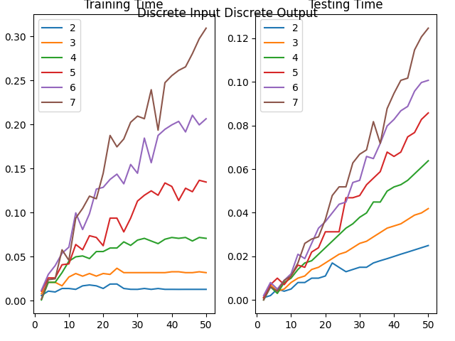
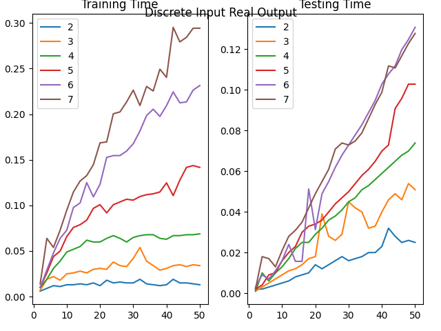
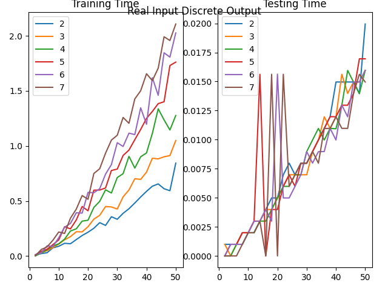
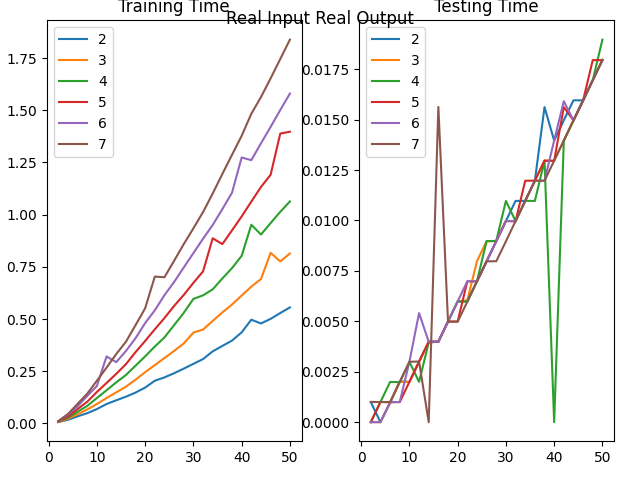

### Answer 4

#### Experimental Observation

1. Training and Testing time for Discrete Input Discrete Output
    

2. Training and Testing time for Discrete Input Real Output
    

3. Training and Testing time for Real Input Discrete Output
    

4. Training and Testing time for Real Input Real Output
    

#### Theoretical

##### Discrete Input

- The work done at each depth is O(mn) and the depth is atmost m. So, complexity for training is O(m^2*n).

- For predicting, a the time is proportional to the depth of the tree. So, complexity for testing is O(m) per row.

##### Real Input

- The work done at each depth is O(mnlogn) and the depth is atmost n. So, complexity for training is O(m*n^2logn).

- For predicting, a the time is proportional to the depth of the tree. So, complexity for testing is O(n) per row.

#### Comparison

The testing plots appear to linearly increasing with m and n which matches with the theoretical estimation.

The training plots for the discrete inputs increase more with m is increased as the lines are farer than in the case of real inputs.

In the case of real inputs, there appears to a steaper increase with an increase in n.

The above two observations also match with the theoretical analysis.