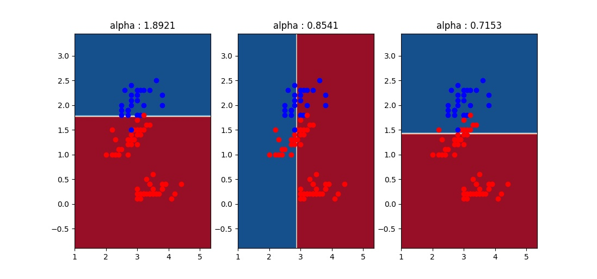
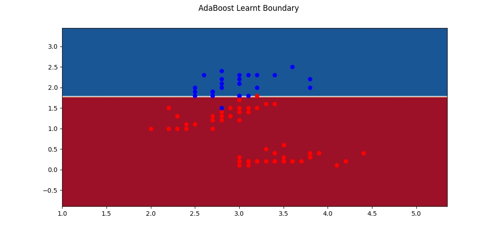
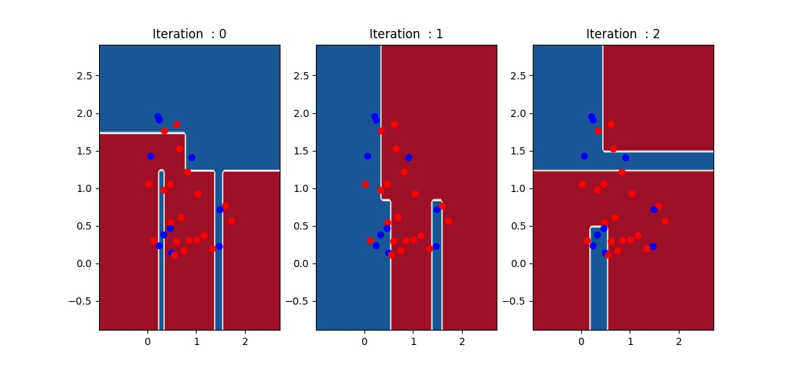
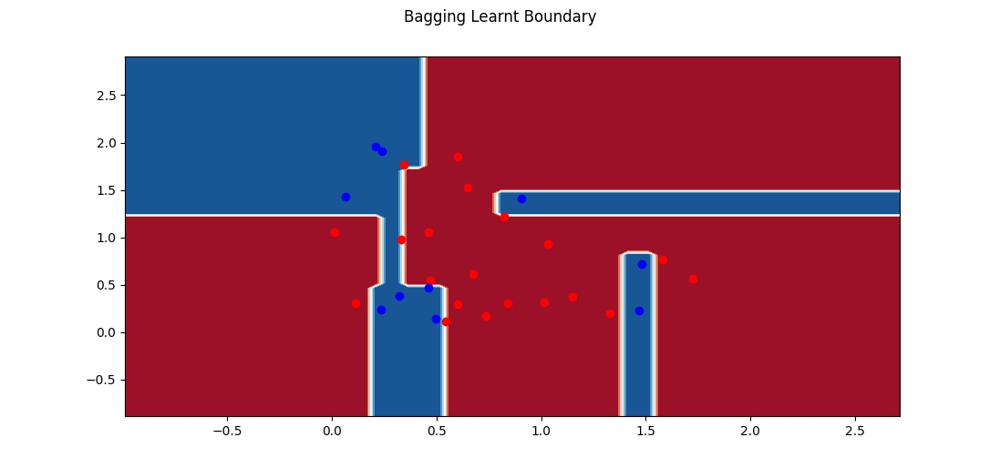
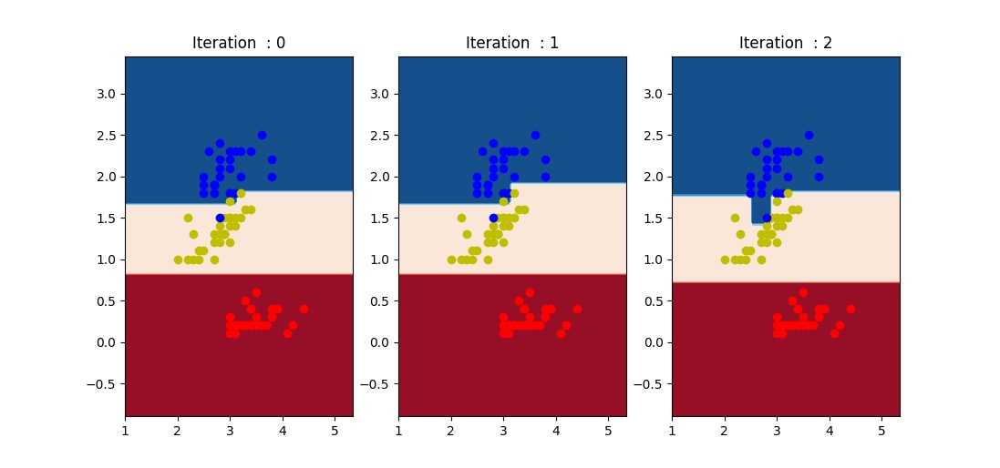
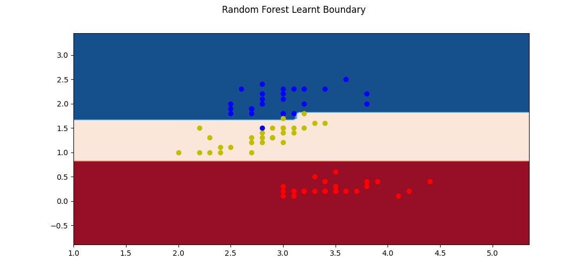

### Answers

1. All functions and class template have been completed.

2. Performance on the Iris Dataset (70-30 shuffled split)
- Accuracy:  0.9777777777777777
- Precision (class 0):  1.0
- Recall (class 0):  0.9411764705882353
- Precision (class 1):  0.9230769230769231
- Recall (class 1):  1.0
- Precision (class 2):  1.0
- Recall (class 2):  1.0

- 5 Fold Cross-Validation Accuracy : 0.9544086021505376
It was computed by taking the average of accuracy on the set set over all 5 folds

Nested Cross Validation

- Optimal Depth for iteration 1:  6
- Accuracy on test set of optimal depth in iteration 1 : 0.9333333333333333
- Optimal Depth for iteration 2:  4
- Accuracy on test set of optimal depth in iteration 2 : 0.9354838709677419
- Optimal Depth for iteration 3:  2
- Accuracy on test set of optimal depth in iteration 3 : 0.9354838709677419
- Optimal Depth for iteration 4:  2
- Accuracy on test set of optimal depth in iteration 4 : 0.967741935483871
- Optimal Depth for iteration 5:  5
- Accuracy on test set of optimal depth in iteration 5 : 1.0

3. Performance on the real-estate dataset (70-30 shuffled split)

- My tree RMSE 0.7855410318014447
- Sklearn Tree RMSE 0.7403284452839509
- My tree MAE 0.2081609195402299
- Sklearn Tree MAE 0.17551724137931035

Possible reasons for slight deviation
- The function to measure the quality of a split in my implementation is Varience whereas sklearn uses some other metric.
- Python's handling of floats. Python sometimes incorrectly handles floats. For instance, I compared the trees generated by my implementation and sklearn on some data, they were the same except for one node.The threshold in my tree was 1.70000001 and in the sklearn tree was 1.7. This insignificant change was affection the accuracy of my classifier on the corresponding test data.
- Some other optimization in sklearn.

4. In 4.md

5. a) The given functions and class template has been completed.
   b) Performance on the Iris Dataset (60-40 shuffled split, Two Classes : Virginica and Not Virginica)
      - Accuracy:  0.9333333333333333
      - Precision (class 0):  0.9
      - Recall (class 0):  1.0
      - Precision (class 1):  1.0
      - Recall (class 1):  0.8333333333333334

      Decison Boundary for the three decison stumps learnt are in the below figure.
      

      Decison Boundary for the overall classifier learnt is in the below figure. 
      

6. The given functions and class template has been completed.
    - Performance on the random data
    - Accuracy:  0.9333333333333333
    - Precision (class 0):  0.9
    - Recall (class 0):  0.9
    - Precision (class 1):  0.95
    - Recall (class 1):  0.95

    
    Decison Boundary for the three decison stumps learnt are in the below figure.
    

    Decison Boundary for the overall classifier learnt is in the below figure.

    

7. a) The given functions and class template has been completed.
   b) Performance on the iris data (2 features, sepal width and petal width)
    - Accuracy : 0.9333333333333333
    - Precision (Class 0):  1.0
    - Recall (Class 0):  1.0
    - Precision (Class 1):  0.84
    - Recall (Class 1):  1.0
    - Precision (Class 2):  1.0
    - Recall (Class 2):  0.8333333333333334

    Decison Boundary for the three decison stumps learnt are in the below figure.
    

    Decison Boundary for the overall classifier learnt is in the below figure.

    