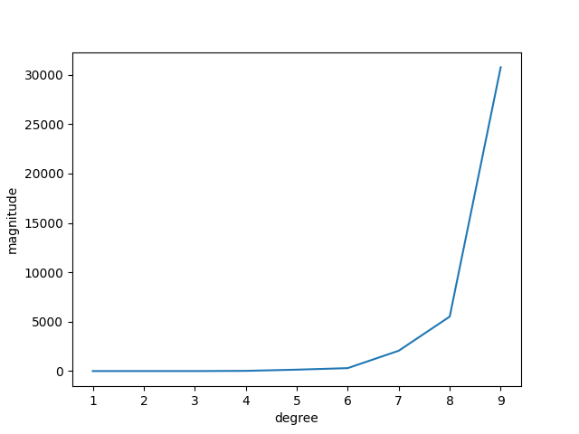

### Magnitude vs Degree

In the following figure, magnitude of theta is increasing with an increase in degree. This may be because as the degree is increasing the algoritmn is trying to learn complicated relationships thereby having big values (in terms of absolute value) of the parameters. A contributing factor leading to learning to complex relationships could be the small size of the input samples.

