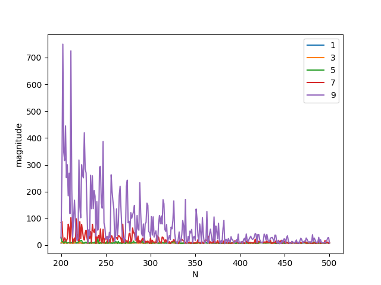

The higher degree results in higher magbitude , like the previous figure. The value of magnitude is decreasing with increasing N because the higher number of samples may be allowing the model from cancelling the noise that is due to the normal function that is added to y and stopping it to learn complicated relationships that try and fit the noise.

