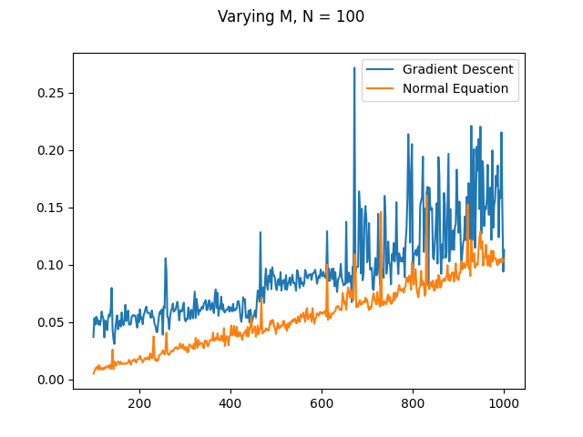
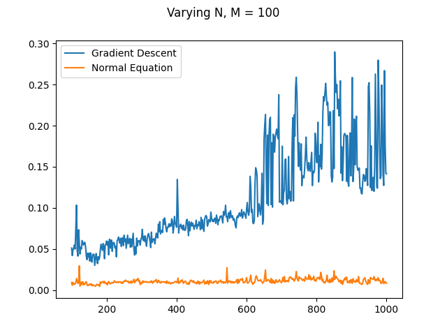

### Theoretical Time Complexity:
| Gradient Descent | Normal Equation |
| ------------- | ------------- |
| O(D2(t+N))  | O(D2(N+D)+D3)|

### Experimental Plots

### Comparison
The rate of increase of time taken in the case of Normal Equation is higher than of Gradient Descent when M is varied. This is consistent with the theoretical complexity as it increases at cubic rate.

Theoretically both should increase linearly with N but Normal equation has a very low increase in time with increasing N. This behaviour is not seen with gradient descent. This may be attributed to the constants involved.
