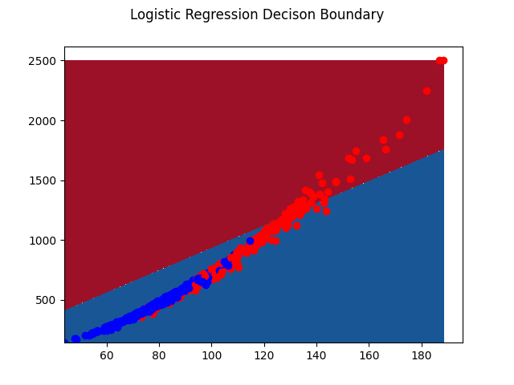
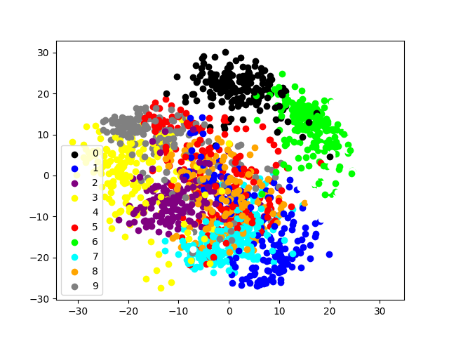

## Solutions

### Assignment 3, Machine Learning, IIT Gandhinagar, Spring 2021.
#### Name : Mihir Vikram Jain
#### Roll Number : 18110100

#### Q1
Logistic Regression class is implemented in logistic_regression.py.
The K(=3) Fold Accuracy for the 2D plot can be generated by running 
q1.py.

Average accuracy over 3 Folds :  
- Without Autograd :  0.9051332033788174  
- With Autograd :  0.9051332033788174  

#### Q2

For Nested Cross-Validation, K1 is taken as 3 and K2 is taken as 3.
The results can be generated by running q2.py. 

Yes, More Important featres can be inferred from L1 regularization. This can be done by running the L1 regularized model over many epochs. The coffecients for the less important features will go to zero first.

Regularization :  L1  
Fold :  0  
	 > Best Penality :  0.01  
	 > Test Accuracy with Best Penality :  0.9315789473684211  
	 Following are the Three Most Important features :  
		 > worst concave points  
		 > mean concave points  
		 > mean concavity  
Fold :  1  
	 > Best Penality :  0.01  
	 > Test Accuracy with Best Penality :  0.9105263157894737  
	 Following are the Three Most Important features :  
		 > worst concave points  
		 > mean concave points  
		 > mean concavity  
Fold :  2  
	 > Best Penality :  0.01  
	 > Test Accuracy with Best Penality :  0.9206349206349206  
	 Following are the Three Most Important features :  
		 > worst concave points  
		 > mean concave points  
		 > mean concavity  

Regularization :  L2  
Fold :  0  
	 > Best Penality :  0.01  
	 > Test Accuracy with Best Penality :  0.9210526315789473  
Fold :  1  
	 > Best Penality :  0.01  
	 > Test Accuracy with Best Penality :  0.968421052631579  
Fold :  2  
	 > Best Penality :  0.01  
	 > Test Accuracy with Best Penality :  0.91005291005291  

#### Q3
The K(=4) Fold Accuracy for the 2D plot can be generated by running 
q3.py.  

Confusion matrix for Fold :  0
[[43  0  0  0  0  0  0  0  0  0]  
 [ 0 41  3  0  0  0  1  0  0  6]  
 [ 1  1 38  1  0  0  0  1  1  1]  
 [ 0  0  0 41  0  0  0  1  0  0]  
 [ 1  0  0  0 43  0  0  2  1  0]  
 [ 0  0  0  0  0 38  1  0  0  1]  
 [ 0  0  0  0  0  0 51  0  0  0]  
 [ 0  0  0  0  0  0  0 45  0  0]  
 [ 0  4  2  1  0  2  0  2 31  3]  
 [ 0  1  0  1  1  0  0  2  0 37]]  
Confusion matrix for Fold :  1  
[[47  0  0  0  0  0  0  0  0  0]  
 [ 0 34  1  0  0  0  1  0  1  0]  
 [ 0  2 40  3  0  0  0  0  1  0]  
 [ 0  0  0 43  0  1  0  2  0  0]  
 [ 0  0  0  0 43  0  0  1  0  0]  
 [ 0  0  0  0  0 45  0  0  0  3]  
 [ 0  2  0  0  0  0 42  0  0  0]  
 [ 0  0  0  0  0  1  0 41  1  0]  
 [ 0  5  0  0  0  0  0  0 31  0]  
 [ 0  2  0  2  2  2  0  2  0 48]]  
Confusion matrix for Fold :  2  
[[49  0  0  0  0  0  0  0  0  0]  
 [ 0 37  2  0  0  0  2  0  2  4]  
 [ 0  2 38  0  0  0  0  1  0  0]  
 [ 0  1  1 39  0  0  0  3  0  0]  
 [ 0  0  0  0 35  0  0  1  1  0]  
 [ 1  0  0  0  0 40  0  0  0  5]  
 [ 1  0  0  0  0  0 44  0  0  0]  
 [ 0  0  0  0  0  0  0 49  0  0]  
 [ 0 10  0  2  0  1  1  1 24  7]  
 [ 0  0  0  0  0  1  0  3  1 40]]  
Confusion matrix for Fold :  3  
[[38  0  0  0  1  0  0  0  0  0]  
 [ 0 38  2  0  0  1  0  0  0  6]  
 [ 0  1 45  0  0  0  0  0  0  0]  
 [ 0  0  0 43  0  1  0  1  2  4]  
 [ 0  3  0  0 48  0  0  2  0  0]  
 [ 0  0  0  0  1 44  0  0  0  3]  
 [ 0  1  0  0  1  0 39  0  0  0]  
 [ 0  0  0  0  0  0  0 42  0  0]  
 [ 1  2  1  2  0  2  1  3 33  2]  
 [ 0  0  0  1  1  2  0  0  0 31]]  

Average accuracy over 4 Folds :  
	 > Without Autograd :  0.9003860430586489  
Digit with highest average accuracy :  0  
Digit which get confused most :  1 8  

Note : Running With Autograd gives similar results but it is very time-consuming.  

Inferences :
- 0 has best average accuracy over all folds and in the plot all the 0 points form a cluster and very few points of other classes are closer or in the cluster.  

- The clusers of 1 and 8 (Most confused digits) are very inter-mixed in the central region of the plot.  
 
#### Q4

See A4.md

#### Q5 and Q6

For this question, I have switched to JAX becuase of added advantage of JIT. Also, I ran the code on Google Colab for faster training.

The Notebook for the code : NN.iynb
Link to Colab File : https://colab.research.google.com/drive/1kqVBkbwWwI9tRVGm5qXdcCgk--FYgwh7?usp=sharing

Boston Dataset :
- Hidden Layers : [64,128,128,64]
- Activations : [relu,relu,relu,relu,relu]
- Average 3 Fold RMSE : 4.934939

Digits Dataset :
- Hidden Layers : [128,128]
- Activations : [relu,relu,relu]
- Average 3 Fold Accuracy : 0.9109627156371731

#### Q7

The Notebook for the code : Q7.iynb

Link to the Colab File : https://colab.research.google.com/drive/1xAGXWlhx7ZrgHKgvS05arURF70BbhxXf?usp=sharing

The plots can be seen from the colab file.

Note that for testing, images must be manually uploaded in collab seesion storage. The dataset created can be found in ./Dataset.
